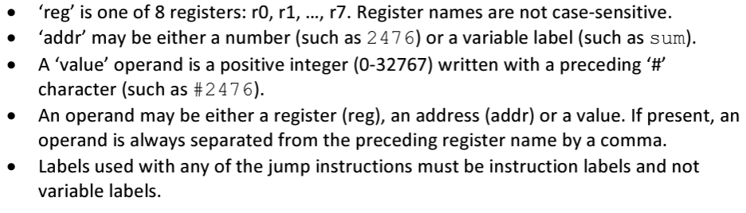
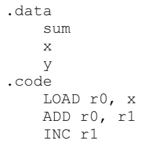
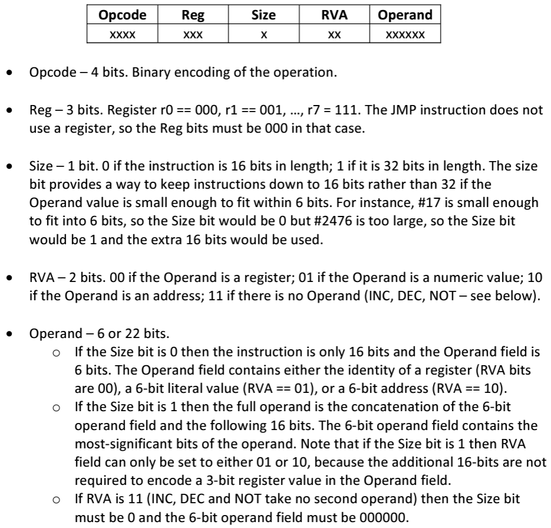
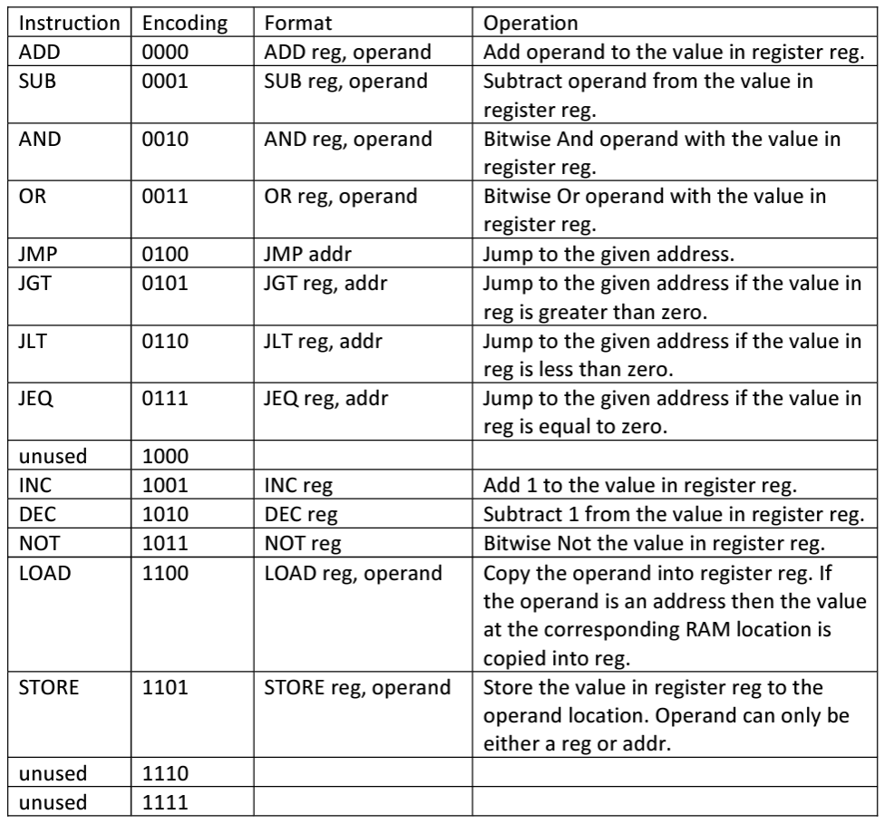
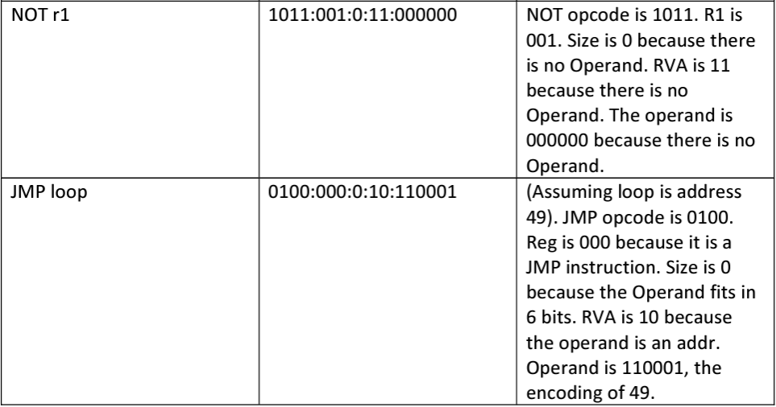
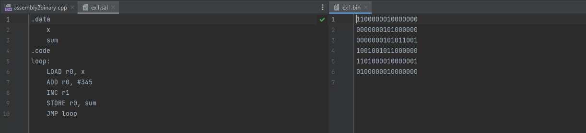
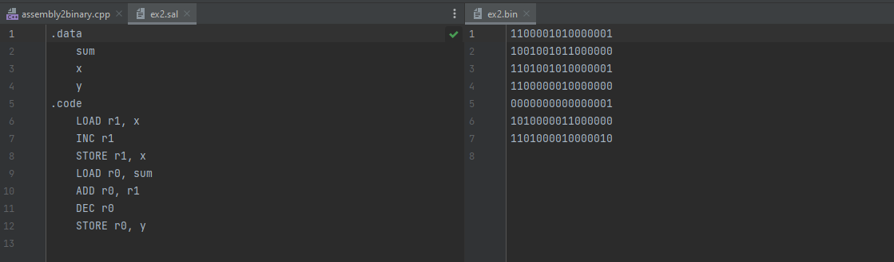
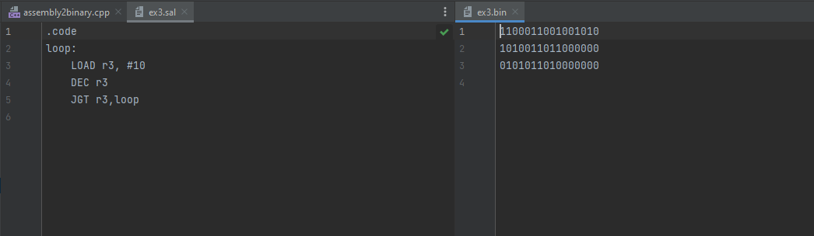
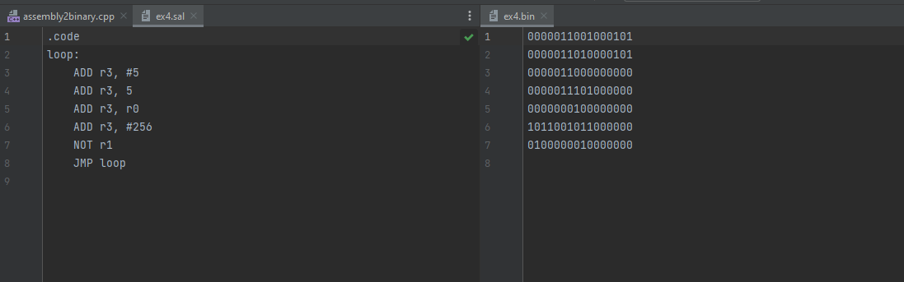
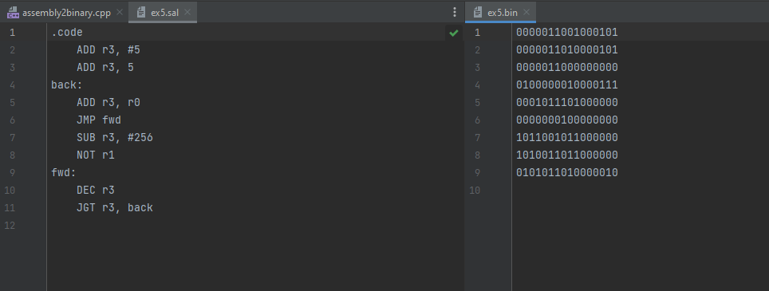

# Assembler
<h2>Motivation</h2>
This project was mainly constructed to comprehend the practical understanding of the task of writing an assembler. It is inspired by the course
<a href = "https://www.nand2tetris.org/)https://www.nand2tetris.org/">nand2tetris</a>.

The input to the assembler is a .sal file which gets processed by the main.cpp file consisting of various functions that it uses to
produce its equivalent binary code (.bin file). This project is not the precise representation of how an actual assembly language
functions (e.g. x86) but an abstract representation of understanding the key elements of processing and translating the syntax.

**The key details of the assembler are as follows;** 
<ul>
<li>The input to the program is a .sal file to which its binary output is a text file containing 1 or more lines of text, each 16 characters
long, with each character being either 1 or 0.</li>
<li>The input to the program is a .sal file to which its binary output is a text file containing 1 or more lines of text, each 16 characters
long, with each character being either 1 or 0.</li>
<li>The program takes a single command-line argument which is the name of the SAL souce file to be translated.</li>
<li>The assembler must write a text file as output. The output file name must have the same prefix as the SAL source file but a '.bin' suffix.
For instance, if the SAL file is called prog.sal, then the output file will be called 'prog.bin'.</li>
<li>Whitespaces are ignored by the assembler. Furthermore, each SAL instruction/label must be written on a single line.</li>
<li>Comments are ignored by the compiler.</li>
<li>All the instruction mnemonics are either 3/4 case-sensitive alphabetic characters long, entirely in uppercase.</li>
<li>The numeric constants are positive integer values, written in decimal notation, in the range 0-32767.</li>
<li>Labels are used as symbolic names for memory addresses. They consist of 1 or more alphabetic, numeric and underscore characters starting with an alphabetic character. SAL distinguishes between labels for ROM instruction addresses and those for RAM data addresses. All labels for RAM data addresses must be ‘declared’ in advance in a ‘data section’ that appears before the instructions. The instructions appear in a ‘code section’ (further details below). ROM labels are ’declared’ by using them to label the following instruction.  Each RAM label corresponds to a 16-bit address, starting at 0. The first RAM label in the data section would be associated with RAM address 0, the second with address 1, and so on.  A label may not be used for a ROM address if it has been declared in the data section as a RAM label. A label must not match either a SAL instruction name (opcode) or register name.  Instruction addresses start at ROM address 0 and each instruction occupies either 1 or 2 16bit addresses. </li>  
</ul>

<h2>Data and Instructions</h2>
The following example shows both data and code sections and how they are introduced in a SAL source file:

Variables are introduced in the '.data' section which exists on a line by itself. On the other hand, the '.code' sections represents the
actual code.

<h2>Instruction labels</h2>
Instruction labels only appear after the .code part has been written on it's own. A label must be followed on the line by a colon character,
optionally separated by spaces. The label naes does not include the colon symbol. A label will appear on a line by itself but multiple
labels, on successive lines, may be used to label the same instruction.

<h2>Conventions</h2>

There is a distinct manifestation between the addr and value operands 2476 and #3476. The former is an address and the latter is a value.
They are distinguished by the presence of a # character. Examples will be provided in the following examples below.

<h2>Instruction Format</h2>
SAL instructions are encoded as either 1 or 2 16-character binary strings. The first 16-bits are encoded as follows:

<h2>Opcodes</h2>
These are 4-bit opcode encodings of all the SAL instructions the assembler recognises.

Some of the examples are shown below;

<h2>Bash Script</h2>
In order execute the commands, the bash scripts need to be as follows;
The instruction for compile would be such as the line below;
bash ./compile.sh
The instruction to assemble the code along with the .sal file would be such as the line below;
bash ./assemble.sh filename.sal

<h2>Examples with actual files</h2>
<h3>ex1.sal</h3>

<h3>ex2.sal</h3>

<h3>ex3.sal</h3>

<h3>ex4.sal</h3>

<h3>ex5.sal</h3>

